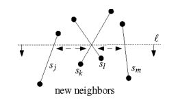
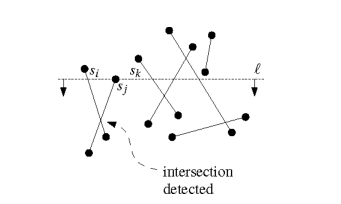
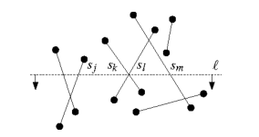
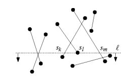

> 前排提示, 这是计算几何领域, 因此了解算法思路大致相当于你能纸上谈兵. 具体在实际应用中解决相关问题需要具备强大的编程技巧(你需要考虑一系列边界条件避免整体算法性能退化), 以及对相关代码的熟悉(你需要考虑算法如何基于你所拥有的数据表达形式落地). 别想着不看具体代码看了些伪码你就天下第一了, ~~没错说的就是一些不想实操的算法工程师(懒狗)~~.
{: prompt-tip }

## 简介与前置

对于一个线段集合, 求集合内所有线段的交点朴素算法是一一判断, 时间复杂度是 $O(n^2)$. 同时, 这也是这类问题最坏情况下的时间复杂度. 最坏情况为集合内的所有线段两两相交.

对于计算几何而言, 优化算法的思路一般为找到一种特殊情况, 且该特殊情况在实际应用中出现频率较高时, 通过特殊情况的流程优化整体算法. 简而言之, 计算几何是一个**玩特例**的学科.

对于当前问题而言实际情况中, 线段相交的情况较少. 因此我们需要考虑一种能够在相交点较少情况下求出交点的高效算法. 对于这种时间复杂度由输出结果规模决定的算法, 我们称之为输出敏感型算法(Output-sensitive algorithm), 你会在很多计算几何相关的算法中见到这个词.

平面扫描线算法, 计算几何的基石之一(不知道其他领域, 单单是我接触到的情况而言, 似乎万物皆可扫描线, 毕竟后端验证只在乎相交问题吗), 用于解决边集合求交点的问题. 算法设计的初衷在于避免"间隔过远"的线段间进行不必要的相交判断(此处的间隔过远是一种感性的说法).

大致思路是, 对于两个线段, 如下图所示可以通过投影(x/y都可)排除一定不相交线段.


## 扫描线算法

### 基本原理

那么假设有一条水平的扫描线从下至上扫过整个线段集, 所有与当前扫描线相交的线段集合能够表示当前状态(因此扫描线中的一个集合实际上表示的是一个扫描区间). 到达特定位置时, 当前扫描线的状态获得更新, 我们称这些特定位置为事件点(event point)或事件(event).

具体来说, 每到达一个事件点, 首先判定这个事件点的类型. 如果是线段的起点, 那么意味着该线段开始和扫描线相交, 因此这个线段将会加入到一个数据结构中(可以理解为活动边, 即这个结构中的边都和扫描线相交); 如果是线段的终点, 那么意味着该线段终止和扫描线相交, 则将该线段移除.

在目前情况下, 我们只需要检查每个状态下的活动边之间的相交情况即可. 然而, 有一些常见特例迫使我们进一步优化算法. 例如一个活动边集合内都是垂直线, 这种情况在没有交点产生的情况下, 我们依旧需要花 $O(E^2)$ 的时间复杂度检查活动边集合(其中 $E$ 表示活动边集合大小). 那么又再次回到了扫描线的开头, 在这种情况下如何保证算法是输出敏感的?

很显然, 情况与开头类似那么解法也类似. 我们可以引入一个垂直的扫描线, 对活动边集合进行扫描. 即, 我们需要保证在 x/y 轴两个方向上的投影都是相交的边做为最终的活动边集合. 每加入一条新的线段, 该线段只需要和该线段起点左右紧邻的边检查是否相交即可.

然而, 当扫描线经过交点时, 某条线段的左右邻居边可能发生变化. 这种状态上的变化使得我们需要将所有边的相交加入事件点. 整个算法的正确性由"对于任意两条相交线段, 一定存在某个位置使得扫描线抵达该位置时, 这两条线段是紧邻的."保证.

> 笑死, 不会真的来看我给出一个严格的证明吧? 我有那个能力吗? 我根本就没有!



综上, 整个扫描线算法将会出现三种状态(事件点), 起始点事件/交点事件/终止点事件, 接下来我们将详细阐述各个事件点进行的计算过程

#### 起始点事件

> 这里用起始点事件主要是概括从上至下或从下至少扫描时遇到的首个线段端点的事件
{: prompt-info }

扫描线触发起始事件点 $s_{j}$, 考虑以下过程:

* 新线段插入有序集合后找到左右紧邻线段
* 检查是否与其左右紧邻线段相交
* 若无交点, 扫描线继续推进至下一个事件点
* 若有交点, 检查所有交点(至多两个)
  * 检查交点与扫描线在扫描方向上的相对位置
  * 若未被扫描(即在扫描线的扫描方向上), 视作新事件点
  * 若已被扫描, 不做处理

伪代码如下:

```c++
// 与图相同, 假设水平扫描线从上至下扫描
void start_event(Edge &new_edge, int scanline_y) {
  active_edges.insert(new_edge);
  auto iter = active_edges.find(new_edge);
  Edge left_edge = iter->prev(), right_edge = iter->next();
  std::vector<Point> intersections = find_intersections(new_edge, left_edge, right_edge);
  std::for_each(intersections.begin(), intersections.end(), [&](const Point &p){ if (p.y < scanline_y) add_event(p.y); });
}
```



如图所示, 在 $s_j$ 触发起始点事件, 找到相邻线段 $s_i$ , $s_k$ , 分别计算交点, $s_j$ 与 $s_i$ 的交点在扫描线前进方向上, 加入新的事件点

#### 交点事件

扫描线触发交点事件后考虑以下过程:

* 更新活动边所在的有序集合(事实上, 只需要更新与交点相关的线段的顺序)
* 更新后的边与紧邻线段检查交点情况(与起始点事件一致)

伪代码如下:

```c++
void intersect_event(Edge &interacted_start_edge, Edge &interacted_end_edge, int scanline_y) {
  auto start_iter = active_edges.find(interacted_start_edge), end_iter = active_edges.find(interacted_end_edge);
  std::sort(start_iter, end_iter, CompareFunction(scanline_y));
  // doing same intersection check as start_event
}
```



如图所示, 触发交点事件后, 与交点相关的 $s_k$, $s_l$ 更新排序, 分别与 $s_j$, $s_m$ 两个线段检查交点.

> 注意, 交点事件触发后的新交点检查可能会存在重复检查的情况. 即在这个事件发生前可能已经检查过, 以及在这个事件发生后仍然可能再次检查.
{: prompt-tip }

#### 终止点事件

扫描线触发终止点事件后考虑以下过程:

* 触发的线段移除活动边的集合, 移除的操作可能会使得本不紧邻的两条线段紧邻.
* 对因为移除线段产生的新紧邻边情况检查交点

伪代码如下:

```c++
void end_event(Edge &remove_edge, int scanline_y) {
  auto iter = active_edges.find(remove_edge);
  if (iter->prev() && iter->next()) { // 紧邻边都合法时
    check_intersections(iter->prev(), iter->next());
  }
  active_edges.erase(remove_edge);
}
```



如图所示, $s_l$ 触发终止点事件将会被移除活动边, 此时 $s_k$, $s_m$ 变为邻接情况, 因此检查二者的交点

#### 小结

很明显, 根据上述三种事件让我们明白了, 计算几何的残酷就在于, 伪代码几乎不提供任何信息. 看了也白看, 不和一众工程细节在烂泥地里打个你死我活是根本学不到什么的. 即, 我们在学习大致思想时也必须抓住一些特例细节, 否则整个算法的迭代你将会摸不着头脑.

对于交点事件中, 我们显然需要考虑多条线段相交于同一点的情况, 因此我们就需要在整体算法中维持一个数据结构, 能够列举出与这个交点相交的所有线段.

此外, 还有诸如线段部分重叠的情况等等特例, 这要求我们需要明确针对这些特例, 我们应当给出什么样的结果.

### 涉及的数据结构

#### 事件集合

很显然, 前文中的所有事件都需要一个数据结构进行存储. 当新事件产生时将会插入至该数据结构, 在触发事件时将该事件从数据结构中删除. 考虑到可能存在多个事件点在同一水平线上, 因此我们可以做出如下规定:

```c++
// 扫描线从上至下, 从左至右触发事件
bool Event::operator<(const Event &a, const Event &b) {
  return a.y == b.y ? a.x < b.x : a.y > b.y;
}
```

我们需要高效插入(显然)/删除(前面已经说过了)/查询(不需要重复事件点)/维持有序(前面已经说了), 因此显然需要一个平衡搜索树.

#### 状态集合

如前文, 当前的扫描线所相交的线段集合构成状态. 我们需要这个数据结构具备以下功能:

* 高效插入/删除: 方便插入与扫描线相交的线段以及脱离扫描线的线段
* 维持有序: 在 x/y 方向上分别投影避免过大的相交检测范围
* 能够访问一条线段的前后元素, 方便进行相交检测

那么很显然, 这也可以通过平衡搜索树实现.

### 特例

#### 多线段相交同一点

这说明一个事件点涉及多条线段, 且该交点可能是其他线段的起始点或终止点. 我们将展开前文描述的针对事件点的处理. 考虑到达一个事件点 P 时应有如下流程:

* 搜集以点 P 为起始点的所有线段
* 在当前状态下, 搜索以点 P 为终止点的所有线段, 以及点 P 在内部的所有线段
* 如果上述三个集合的并集大于1
  * 特例1: 多线段相交同一点 P
* 


```c++
void Event::trigger(Point &p, int scanline_y) {
  // 寻找所有以 P 为起点的边
  std::vector<Edge> _edges = find_edges_from_start(p);
  auto iter = std::
}
```


## 参考文献

额外吐槽, 从个人角度来看这本书写得很烂很烂. 需要详细阐述的算法特例部分会被省略, 不需要阐述的相关的基础数据结构反而会花很大篇幅描述甚至画图理解(一个 `std::set` 你还画个图展示每个结点在事件点前如何更新的?). 在我看来就是一个适合给在顶层飘飘然的算法工程师增加谈资的一本书. 对于解决实际的工程问题帮助很小.

* 计算几何: 算法与应用