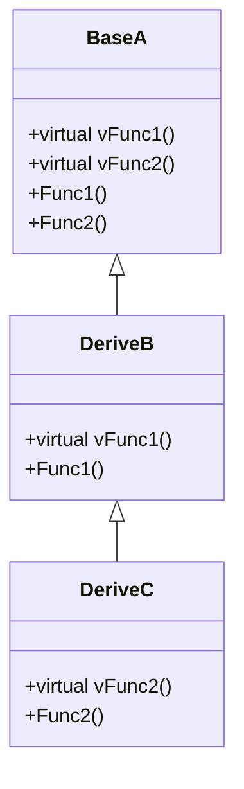

## `vptr` 与 `vtbl`

只要当基类中存在一个虚函数, 该类就会生成一个虚指针. 因此你在计算一个类的大小时, 会发现比所有类其中的数据大小之和多一个指针的大小( 32位系统是 4 字节, 64位则是 8 字节 ). 该指针与所有的虚函数相关联, 与非虚函数无关.

`vptr` 指向的记录了虚函数的信息的表格, 就叫做虚表格 `vtbl`. 该表格内存放了该类中的所有虚函数指针( 指向函数的指针, 非虚指针 ).

### 继承关系下的 `vptr` 与 `vtbl`

当然, 虚函数被大量运用在继承关系下, 那么进行分析就很应该了. 类图如下:



在创建上述三个类的实例 `A B C` 后, 非虚函数有: `A::Func1`, `A::Func2`, `B::Func1`, `C::Func2`. 对象 `A` 的虚表存储: `A::vFunc1`, `A::vFunc2`, 对象 `B` 的虚表存储: `B::vFunc1`(`B` 重载后有对应的新的虚函数地址), `A::vFunc2`(该地址于对象 `A` 中的一样), 对象 `C` 的虚表存储: `A::vFunc1`, `C::vFunc2`

### 静态绑定( static binding )与动态绑定( dynamic binding )

静态绑定: 编译过程中, 将函数的调用转换为对应的地址, 通过 `call functionAddr` 调用

此时, 当符合下列三个条件时, 编译器不再通过静态绑定的方式, 而是使用动态绑定.

* 通过指针调用
* 该指针向上转型(up-cast)
* 调用的是虚函数

解析后有如下类似步骤:

```c++
DeriveC c;
DeriveC *p = &c;
// 调用虚函数: 通过找到实例的虚表中对应的虚函数地址
(*p->vptr[n])(p);
```

> 其中的 `n` 为编译阶段, 编译器根据代码中虚函数的顺序决定. 即代码中第一个出现的虚函数, 此时有 `n == 0`. 动态在于在运行过程中, 只有运行到那一行才能确定该指针的类型, 编译器通过指针调用, 而非静态绑定在基类代码写完的那一刻就知道了调用所需的地址.
{: .prompt-info }

显然, 在一个拥有复杂继承关系的系统中, 通过虚函数继承的动态绑定相较于静态绑定能够节省巨量的代码维护. 如果是静态绑定, 那么基类中就必须判断执行的派生类类型, 从而给出不同的调用. 而动态绑定, 可以直接通过指针, 指向派生类对应的虚函数直接执行. 静态绑定在关系更新(如增加额外派生类)时, 需要重写维护基类, 而动态绑定无需额外维护基类.

为了方便理解, 给出下列示例代码, 通过注释进行解释:

```c++
DeriveB b;
Base a = (Base)b;
// 静态绑定: 调用 Base::vFunc1()
a.vFunc1();

// 一个基类指针通过派生类构造( 隐式向上转型 )
Base *ptrA = new DeriveB();
// 动态绑定: 通过指针调用虚函数, 且上述有向上转型, 调用 DeriveB::vFunc1()
ptrA->vFunc1();

// 指针指向派生类的地址( 显式向上转型 )
ptrA = &b;
// 动态绑定: 通过指针调用虚函数, 且上述有向上转型, 调用 DeriveB::vFunc1()
ptrA->vFunc1();
```

> 突然想到了以前看到的巨量 `if-else` 代码, 不知道拥有一个好的设计之后, 这种判断的数量是否会大幅下降

这玩意儿和 C++ 三大特性息息相关: 多态 继承 封装. 在基类中实现派生类的代码复用, 通过虚函数为派生类设计接口. 然而万物都是双刃剑, 动态绑定通过虚指针虚表来寻址执行函数势必比静态绑定慢, 且在[内存声明与释放中](https://jebearssica.github.io/posts/memory-claim-and-reclaim/#%E6%95%B0%E7%BB%84%E5%86%85%E5%AD%98%E5%A3%B0%E6%98%8E%E4%B8%8E%E5%9B%9E%E6%94%B6array-new--array-delete)也提到了, 会增加类的实际占用, 在子类并没有覆盖基类的多继承场景中尤为明显.
