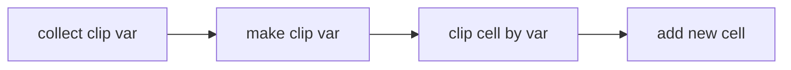

> TL;DR: `clip_layout` 根据给定的切割网格, 将原始 layout 给切割成目标 layout
{: .prompt-info }
> 为了缩减非重点代码, 以及简化写法, 文中涉及代码可能通过C++11以上的特性或直接进行简写, 与源代码不一致. 总之就是因为个人喜好, 有关 Klayout 的源码会有所变动.
{: .prompt-tip }

## 简介

主要流程非常明确:



接下来逐步解析各个流程的代码

### `collect_clip_variants`

在主流程中, 将会逐个遍历给定的切割网格队列, 搜集每个网格下的 variants

> EDA 工具中常常会见到 Cell-Instance 的概念. 在 Klayout 中引入了 variant 的概念, 可以视作一个即将变化的 instance (i.e. instance 变量)
{: .prompt-tip }

```c++
static void 
collect_clip_variants (const db::Layout &layout,
                       db::Layout &target_layout,
                       db::cell_index_type cell_index,
                       const db::Box &clip_box,
                       std::map <std::pair <db::cell_index_type, db::Box>, db::cell_index_type> &variants,
                       bool stable)
{
  const db::Cell &cell = layout.cell (cell_index);
  db::box_convert <db::CellInst> bc (layout);

  db::Box cell_box;
  if (stable) {
    cell_box = clip_box;
  } else {
    cell_box = cell.bbox () & clip_box;
    // 提前终止条件, 避免无意义更深遍历
    if (cell_box.empty ()) {
      return;
    }
  }
  // 虽然 variants 的初衷只是收集需要的结果, 并不专用于 cache 优化 DFS. 但既然已经有了那就一石二鸟.
  if (variants.insert ({ {cell_index, cell_box}, 0 }).second) {

    for (auto inst = cell.begin_touching (cell_box); ! inst.at_end (); ++inst) {
      for (auto a = inst->cell_inst ().begin_touching (cell_box, bc); ! a.at_end (); ++a) {
        // 将剩余的切割网格 transform 至 instance a 所在的坐标系下
        db::Box inst_clip_box = db::Box (cell_box.transformed (inst->cell_inst ().complex_trans (*a).inverted ()));
        collect_clip_variants (layout, target_layout, inst->cell_index (), inst_clip_box, variants, false);
      }
    }

  }
}
```

通过代码可以看出, 实质就是一个 DFS 递归直至切割网格不与 Cell 相交提前终止, 有以下要点:

* 应当明白, 何时才会存在 variant 重复收集的问题?
  * 存在 variant 的复用, 即原 Instance 被切割后产生的新 variant( 也就是 Instance ), 可能被插入到不同的父 Instance 下. 因此从原 Instance 坐标系的角度下, 对应自己的 cell_index 是一样的, 同时当前坐标系下被切后的 cell_box 也一样
* 为何要将 clip_box transform 至对应的 Instance 坐标系下?
  * `Cell::bbox()` 获得的图形在当前 Cell 的坐标系下, 实质最核心的原因还是尽可能复用 instance 不产生更多的新 instance, 因此可以通过在当前坐标系下被切割后的区域判断是否能复用
* 参数 `stable` 的含义?

### `make_clip_variants`

将前文收集到的 variant 信息(实质为 cell 信息)插入至目标 layout, 等价于新建一个 cell 入口, 该部分代码简单, 逻辑清晰

```c++
static void 
make_clip_variants (const db::Layout &layout,
                    db::Layout &target_layout,
                    std::map <std::pair <db::cell_index_type, db::Box>, db::cell_index_type> &variants)
{
  for (auto &v : variants) {
    // 对应的 box 不相等意味着当前 Cell 与 clip_box 相交, 因此需要新增 Cell 
    if (v.first.second != layout.cell (v.first.first).bbox () || &layout != &target_layout) {
      //  need for a new cell
      v.second = target_layout.add_cell (layout, v.first.first);
    } else { // 否则, 认为当前 Cell 完整在 clip_box 内部, 可以直接给原 layout 的 cell_index 用于拷贝
      v.second = v.first.first;
    }
  }
}
```

#### `rename_cell`

这一部分实际并不是 `clip_layout` 的专属流程, 但对于理解最终获得的版图上 cell 名称的命名规律有所帮助.

Klayout 共有两种针对 Cell 进行重命名的方式:

* `Layout::rename_cell(cell_index_type id, const char *name)`: 将指定 cell index 对应的 cell 进行重命名
* `Layout::add_cell`: 拥有一系列的重载, 但通常可以给予一个初始化的名称(可以是一个指定名称, 也可以是一个存在的 cell index 作为 base 进行一定的规则变化)或者系统自动进行命名

对于前者而言, 是一个很简单的操作, 就是将对应的 cell name 进行修改. 我们需要详细讨论一下后者, 因为后者涉及到针对现有的 cell 切割后, 产生的新 cell 的重命名规则.

核心重命名代码如下:

```c++
cell_index_type
Layout::add_cell (std::string &name)
{
  if (!name) {
    name = uniquify_cell_name (nullptr);
  } else {

    cell_map_type::const_iterator cm = m_cell_map.find (name);
    if (cm != m_cell_map.end ()) {

      const db::Cell &c= cell (cm->second);
      if (c.is_ghost_cell () && c.empty ())
        //  ghost cells are available as new cells - the idea is to 
        //  treat them as non-existing.
        return cm->second;
      else
        //  create a unique name
        name = uniquify_cell_name (name);
    }
  }
  // 省略一些对新 Cell 创建以及注册名称等等操作
}

std::string 
Layout::uniquify_cell_name (std::string &name) const
{
  // 如果给定的 name 已经是 unique, 直接返回
  if (name != nullptr && m_cell_map.find (name) == m_cell_map.end ()) {
    return std::string (name);
  } else {

    std::string b;

    //  if the cell does not have a valid name yet, create a unique one.
    unsigned int j = 0;
    // 一个 magic number
    for (unsigned int m = 0x40000000; m > 0; m >>= 1) {
      j += m;
      b = std::string (name ? name : "") + "$" + tl::to_string (j);
      if (m_cell_map.find (b) == m_cell_map.end ()) {
        j -= m;
      }
    } 

    b = std::string (name ? name : "") + "$" + tl::to_string (j + 1);
    return b;

  }
}
```

`uniquify_cell_name` 实现逻辑比较简单和清晰, 但是实现的方法很耐人寻味. 要我自己实现就直接循环从 1 开始就完事儿了, 但他搞了一个看上去很花哨的实现方案. 最终呈现的效果就是类似二进制状态压缩的策略. 将 n 转为二进制视为当前状态, 位上为 0 视为空闲, 1 视为占用, 这里举例:

* n = 5, 101: 表明 [4, 1] 被占用, 下一个重命名的空闲后缀为 6
* n = 7, 0111: 表明 [4, 2, 1] 被占用, 下一个重命名的空闲后缀为 8

即, 一定从最大占用点到上一个空闲点之间找新的空闲点. 我们可以将 $2^n$ 的点位视作每个链表的首指针, 链表长度为 $2^{n-1}$. 这样就等价于 vector 中进行内存扩张的策略了.

> 此外 `0x40000000` 比较有意思. 首先可以明确的这是一个经验值, 因此具体如何考量的我这种菜鸟就不去深究了. 但是比较有趣的地方是, 这里用到了二进制状态的特性, 从而确保了一定能通过非空闲的首指针的和 + 1 得到下一个空闲点
{: .prompt-info }

### `clip_cell`

> 实际上有非常多的前置知识需要掌握, 但本文本来就不是教科书, 目的也只是为了记录个人理解, 因此势必有很多已经掌握较为熟练的知识不会被重复提及.
{: .prompt-warning }

`Instance` 是一个极度重要的概念, 请一定确信是否理解了 Klayout 作者留下的注释

```c++
/**
 *  @brief A instance reference
 *
 *  In analogy to the "shape" reference (i.e. db::Shape), this instance
 *  reference points to a certain instance and provides an abstract interface.
 */
```

他将 `Shape` 与 `Instance` 做类比, 因此需要建立以下的认知: `Shape` <=> `Polygon`, `Instance` <=> `Cell`. 即, 我们能够将 `Shape` 给实例化 (instantiate) 为 `Polygon`, 我们也能将 `Instance` 给实例化为 `Cell`. 前者我们通过 `Shape::instantiate` 来实现, 后者我们通过 `layout.cell (inst->cell_index ())` 来实现. 当我们建立了这个认知之后, 对于 Klayout 的许多与 `Layout` 相关代码理解就会很轻松.

> TL;DR. 就是 `Instance` 具备 `Cell` 的属性.
{: .prompt-info }

在下方核心代码省略的实际切割图形的部分, 混用了 `Shape::box()`, `Shape::bbox()`, 以及实例化为其他类型后的 bbox, 在这里做如下解释:

* `Shape::box()`: 当且仅当 `Shape` 类型为 box 相关类型时使用, 直接返回对应的 box.
* `Shape::bbox()`: 等价于实例化后的 bbox, 含义就是实例化后的图形的 bbox.

```c++
static void 
clip_cell (const db::Layout &layout, 
           db::cell_index_type cell_index, 
           db::Layout &target_layout, 
           db::cell_index_type target_cell_index, 
           const db::Box &clip_box,
           std::map <std::pair <db::cell_index_type, db::Box>, db::cell_index_type> &variants)
{
  const db::Cell &cell = layout.cell (cell_index);
  db::Cell &target_cell = target_layout.cell (target_cell_index);
  // 当 cell 完全在 clip_box 内部时
  if (cell.bbox ().inside (clip_box)) {
    // 要么 layout 不一致，要么同 layout 下 Cell 不一致
    // 否则等于你 input/output 同一个管道
    if (&target_layout != &layout || cell_index != target_cell_index) {

      //  simplification of shape copy op in case of no clipping ..
      for (unsigned int l = 0; l < layout.layers (); ++l) {
        if (layout.is_valid_layer (l)) {
          target_cell.shapes (l) = cell.shapes (l);
        }
      }
      // 开始进行 instance 层面的拷贝
      // 当前 Cell 的 bbox 完全 inside clip_box, 证明所有其下的子 instance 也必定在 clip_box 内
      for (db::Cell::const_iterator inst = cell.begin (); ! inst.at_end (); ++inst) {

        //  instance is completely inside: nevertheless we must look up the target cell for the different layout case.
        db::CellInstArray new_inst = inst->cell_inst ();

        // 这个 Instance 实体所在的位置(实例化 Instance 为 Cell)
        const db::Cell &inst_cell = layout.cell (inst->cell_index ());
        // 意思是没有检查 cell_index 是否合法只能用这个方式检查?
        if (! inst_cell.bbox ().empty ()) {

          auto vmp = variants.find (std::make_pair (inst->cell_index (), inst_cell.bbox ()));
          tl_assert (vmp != variants.end ());
          // 拿到 target_layout 中开好的 instance 的 cell index
          new_inst.object () = db::CellInst (vmp->second);

          //  TODO: keep properties 
          target_cell.insert (new_inst);

        }

      }

    }

  } else { // cell 被切割时

    tl_assert (&layout != &target_layout || target_cell_index != cell_index);
    // 针对每个 layer 中每个与 clip_box 相交的 shape 进行处理
    // 实际的处理过程就是 clip_shape 的过程, 由于 shape 类型较多因此需要分别处理
    for (unsigned int l = 0; l < layout.layers (); ++l) {
      if (layout.is_valid_layer (l)) { 
        for (db::ShapeIterator sh = cell.shapes (l).begin_touching (clip_box, db::ShapeIterator::All); ! sh.at_end (); ++sh) {
          // 省略大量根据 shape 类型进行不同切割操作
        }
      }
    }

    db::box_convert <db::CellInst> bc (layout);
    // 处理完 Cell 开始对子 Instance 进行处理
    // 当前 Cell bbox 与 clip_box 相交, 因此拿到与 clip_box 相交的所有 子 instance 迭代器
    for (db::Cell::touching_iterator inst = cell.begin_touching (clip_box); ! inst.at_end (); ++inst) {

      if (inst->cell_inst ().bbox (bc).inside (clip_box)) { // 完全 inside 直接插入

        //  instance is completely inside
        db::CellInstArray new_inst = inst->cell_inst ();

        const db::Cell &inst_cell = layout.cell (inst->cell_index ());

        std::map <std::pair <db::cell_index_type, db::Box>, db::cell_index_type>::const_iterator vmp = variants.find (std::make_pair (inst->cell_index (), inst_cell.bbox ()));
        tl_assert (vmp != variants.end ());

        new_inst.object () = db::CellInst (vmp->second);

        //  TODO: keep properties 
        target_cell.insert (new_inst);

      } else {
        // 部分相交, 拿相关 instance
        for (db::CellInstArray::iterator a = inst->cell_inst ().begin_touching (clip_box, bc); ! a.at_end (); ++a) {

          db::Box inst_clip_box = db::Box (clip_box.transformed (inst->cell_inst ().complex_trans (*a).inverted ()));
          const db::Cell &inst_cell = layout.cell (inst->cell_index ());

          inst_clip_box &= inst_cell.bbox ();
          // 排除不相交部分
          if (! inst_clip_box.empty ()) {
            // 仍然需要找到 collect 过程中获得的信息
            // 实质是根据被切割后的 cell box 寻找已经新生成的 rename cell, 在这一步对于新生成的 cell 会尽可能复用
            std::map <std::pair <db::cell_index_type, db::Box>, db::cell_index_type>::const_iterator vmp = variants.find (std::make_pair (inst->cell_index (), inst_clip_box));
            tl_assert (vmp != variants.end ());

            db::CellInstArray new_inst;
            // 非 magnification/rotation 直接创建, 否则需要额外做一个 transform
            // 因为 CellInstArray 是一个 Array 中只存了 simple_trans
            if (inst->is_complex ()) {
              new_inst = db::CellInstArray (db::CellInst (vmp->second), inst->cell_inst ().complex_trans (*a));
            } else {
              new_inst = db::CellInstArray (db::CellInst (vmp->second), *a);
            }

            target_cell.insert (new_inst);

          }

        }

      }

    }

  }

}

```
