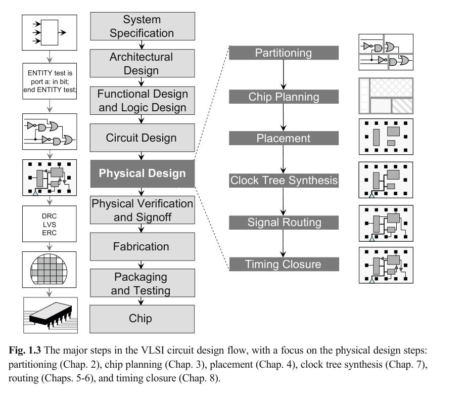
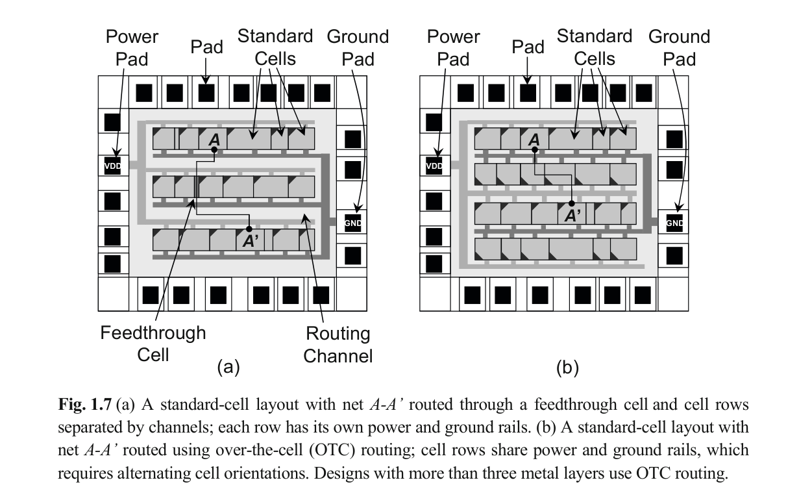
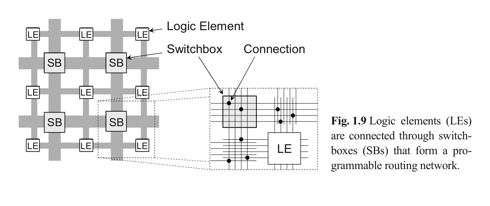

借着 Andrew B.K 的 "VLSI Physical Design" 从 gds 物理验证 DRC, 向上游流程学习.

## Introduction

这本书主要讲的是物理设计过程中常见算法与流程, 做为新人了解该行业背景来说应该是非常好的一本书.

### EDA

介绍了一下电子设计自动化(Electronic Design Automation)的历史, 我不是很感兴趣, 跳过

### VLSI Design Flow

经典流程图, 描述了从零至流片即芯片生产的全流程. 前两个流程非常抽象非常高层级, 大致得是什么芯片设计架构师才能掌握的玄而又玄的东西. 本书以及本文专注于物理设计(Physical Design)的流程.



#### Physical Design

物理设计分为以下流程:

* Partition: 将一个电路分割为多个子模块, 使得每个子模块能够被独立设计与分析
* Floorplan: 决定子模块以及 port/pin 以及 macro block 的摆放及位置
  * Power(power and ground routing): 可以视为 Floorplan 内的一步, 对整个芯片的 VDD 与 GND 网进行分布
* Place: 决定每个 block 内 cell 的位置
* CTS(clock tree synthesis): 决定 buffer/gate
* GR(global routing): 对绕线资源进行分配, 从而实现资源之间的连接. 通常而言, 我们将每个抽象的 GR resource 称为 `GCell`. GR 就是对 `GCell` 进行连接. 可以理解为从一个 driver 至 receiver 的路径, 这个路径又多段 segment 构成, 每个 segment 可以由多个 `GCell` 构成.
* DR(detail routing): 对每个 `GCell` 内部进行实际的各层金属的绕线.
* Timing(Timing closure): 通过迭代 place/routing 以优化整体性能

在 DR 之后, 可以从整个版图中提取寄生参数(电阻/电容/电感), 从而将这些数据传给时序分析工具(timing analysis tool)以检查芯片的功能. 如果出现问题, 可以增量优化.

上述流程针对数字电路的设计, 针对模拟电路的设计流程则有很大不同. 模电设计的方法论我没怎么看懂? 原文如下

```text
The physical design of analog circuits deviates from the above methodology, which
is geared primarily toward digital circuits. For analog physical design, the geometric
representation of a circuit element is created using layout generators or manual
drawing. These generators only use circuit elements with known electrical parameters, such as the resistance of a resistor, and accordingly generate the appropriate geometric representation, e.g., a resistor layout with specified length and width.
```

#### Physical verification

物理验证(Physical verification): 经过物理设计后的版图需要验证以确保拥有正确的电气/逻辑功能. 在物理验证阶段发现的部分问题, 如果对于良率影响不大是可以忽略的. 如果对良率有较大影响, 那么版图必须要进行变更. 这种变更需要确保尽可能小且不引入其他问题, 因此大多数情况下由有经验的大佬手动调整. 物理验证通常需要包含如下部分:

* DRC(Design rule checking): 检查版图是否满足所有的强制限制, 同时也会为了 CMP (chemical-mechanical polishing)检查 layer density
* LVS(Layout vs. schematic): 通过版图导出的网表并将该网表与逻辑综合或电路设计时的网表比较.
* 寄生提取(Parasitic extraction): 通过几何信息导出电气参数, 并于网表共同验证电气特性
* Antenna check: antenna 是一个专有名词, 指代在制造过程中, 由于电荷累积从而击穿金属层.
* ERC(Electrical rule checking): 检查 VDD/GND 连接的正确性, 检查信号转换的时间(slew), 检查电容负载, 检查扇出(fanout)

> 扇出指特定 pin/port 的输出端口数, 扇出过大会使得 driver 负载过大造成较大延迟, 扇出过小会使得该资源没有充分利用从而整体路径较长.
{: .prompt-info }

#### Fabrication

文中提到制造业拿到的是 GDS(或 OAS) layout, 但实际上在物理验证阶段就以及可以拿到 gds 文件. 经过物理验证后送至 foundry(fab) 进行 tapeout. fab 逐 layer 进行光刻, 每层 layer 会通过掩膜(mask), 使得一些特定的图案能够被激光打在硅上. 集成电路制造在晶圆上, 进行检查后合格的继续封装.

### VLSI Design Style

* Full custom design: 限制最小的设计模式, 但是成本高, 耗时长, 因相对缺乏自动化而可靠性差
* Standard cell design:
  * Standard cell: 预定义的, 拥有固定功能与尺寸的 block. standard cell 通过 foundry 给的 cell library 指定分布情况.
  * standard cell 的高度为固定 cell 高度的 n 倍, 拥有 固定的 VDD/GND 出 pin 位置.
  * place 阶段将 standard cell 按行摆放, 最终形成 VDD/GND 水平排列在整个设计中
  * routing 阶段将在不同的由 standard cell 组成的 rows 之间进行
    * channel: cell 间可走线的空间
    * feedthrough: 横穿 cell row 可绕线的空间
    * over-the-cell(OTC): 使用 OTC 绕线策略会让 cell rows 共享电源与接地轨道, 而落后制程通常每个 cell row 有自己独立的电源与接地轨道.



* Macro: 更大规模的逻辑组成的具备可复用功能的 cell, 一般情况下可以像一般 cell 一样随意摆放
* Gate array: 拥有特定逻辑功能的硅晶片
* FPGA: 逻辑元素与连接关系在出厂时已经预设, 可以通过调整查表与 switch box 实现可编程的功能
  * 逻辑元素: 每个逻辑元素可以视为多个查表构成, 其中查表可以视为一个 K 个输入的布尔函数.
  * 连接关系: 可以通过 switch box 将相邻的 channel 连接, 示例如下



### Layout Layer and Design Rule


## Global Routing


