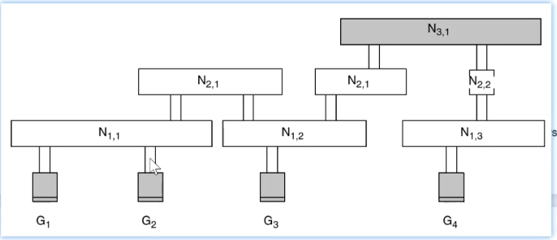

主要记录一下 lef 中对于 antenna rule 的相关信息

## Background

layout 在加工过程中, metal 层会累积电荷, 当电荷累积到一定程度时, 会击穿下方的 gate

## Keywords

ANTTENAGATEAREA: 输入 gate

ANTENNADIFFAREA: 输出 diffusion

## 计算方式

对于 N11 而言, 其对 gate 的影响将会分给 G1 G2;
对于 N12 而言, 对于 gate 的影响将分给 G3;
因此前者计算 antenna ratio 的过程为 N11 area / (G1 + G2) area;
后者为 N12 area / G3;

对于更高层而言, N21 会影响 G1 G2 G3;
这计算方式其实是, 当前层的 metal 能够通过下层连通, 则所有连通的当前层 metal 应该视为一组, 即 N21左 + N21右 / G1 + G2 + G3

怪不得 Klayout 的 merge 那么复杂, 因为带了分层 grouping 以适应 antenna check
